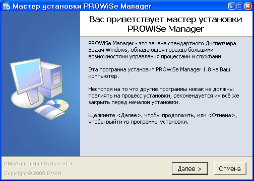
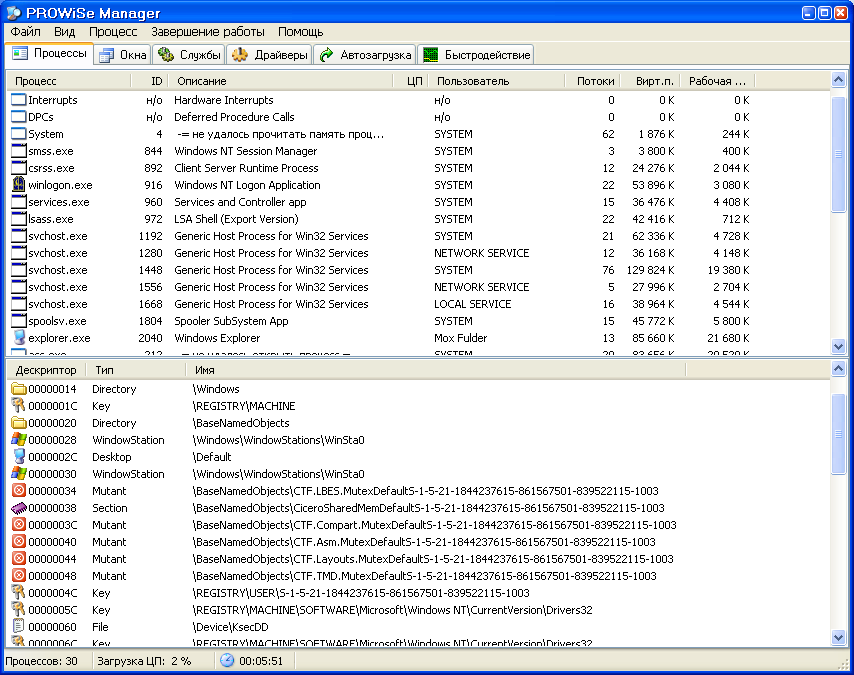
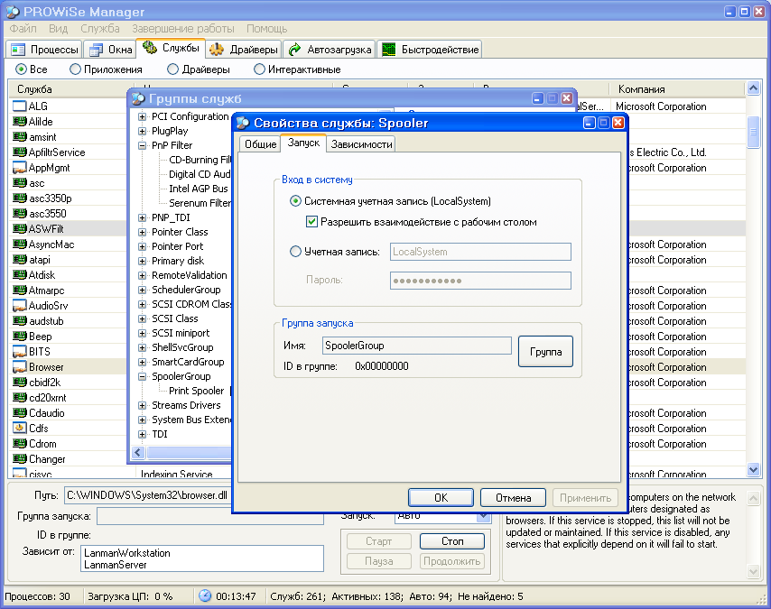
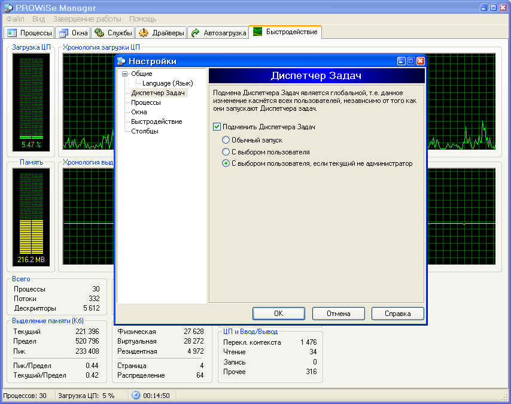
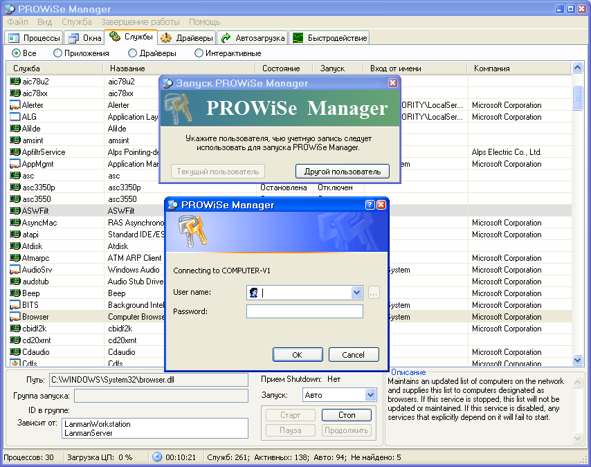

PROWiSe Manager
===============
The project was last updated at 2006.

PROWiSe Manager is an advanced management utility for Windows XP/7 32-bit.

It will show you detailed information about processes and services running on computer.

## Installation and Compatibility

⚠️ **Having trouble starting the application?** See [INSTALLATION.md](INSTALLATION.md) for troubleshooting the common "Application failed to start correctly (0xc0000142)" error on Windows 7/10/11.

**Quick fix:** Install [Visual C++ 2005 Redistributable](https://www.microsoft.com/en-us/download/details.aspx?id=26347) and try running in Windows XP compatibility mode.

## Screenshots

